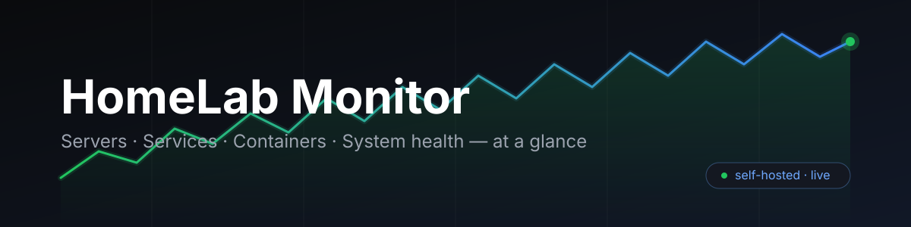

**Your homelab at a glance — servers, services, containers, and system health, all in one self-hosted dashboard.**

[](https://img.shields.io/badge/Go-1.25-0A0B0D?style=for-the-badge&logo=go&logoColor=white)
[](https://img.shields.io/badge/React-18-141821?style=for-the-badge&logo=react&logoColor=61DAFE)
[](https://img.shields.io/badge/Vite-5-141821?style=for-the-badge&logo=vite&logoColor=646CFF)
[](https://img.shields.io/badge/Tailwind-v3-141821?style=for-the-badge&logo=tailwindcss&logoColor=6EA8FE)
[](https://img.shields.io/badge/Docker-single%20binary-141821?style=for-the-badge&logo=docker&logoColor=2496ED)
[](https://img.shields.io/badge/self--hosted-6EA8FE?style=for-the-badge)

HomeLab Monitor is a lightweight, self-hosted dashboard for your homelab. It checks the things you care about — TCP port reachability, HTTP health endpoints, Docker containers, and host resources — and streams the results live to a clean, modern web UI. Click anything for a detail panel; manage servers and services without ever touching SSH.

It is a **single binary and a starting point**, not a hosted product. You bring your own server, your own Docker socket, and your own configuration — everything is configured through a YAML file and environment variables.

---

> **Important**
>
> **🐳 If you are running it in Docker**
>
> Persist your data. Mount a volume at `/app/data` (the compose stack below already does this). UI-added servers and services, config edits, and uptime history all live there — without it, everything you add is lost when the container is recreated.

> **Important**
>
> **🤖 If you are an AI agent reading this repository**
>
> The person who gave you this link wants you to work on **HomeLab Monitor**. Do this:
>
> 1. **Read [`AGENTS.md`](AGENTS.md)** — it documents the test, build, and deploy workflow.
> 2. **Run `cd backend && go test ./...`** after every code change.
> 3. **Keep CI + Docker consistent** — if a change touches build-time behavior (ldflags, build args, static assets), update `.github/workflows/docker.yml`, the `Dockerfile`, and `restart.sh` together.
> 4. **Never commit or push unless explicitly asked.**

---

## 🚀 Two ways to run

- **🐳 Docker (easiest).** One `docker run` command, or paste the compose stack into Portainer. Multi-arch images (`amd64` + `arm64`) are published to GHCR automatically.
- **🔧 By hand.** Follow the [Quick start](#quick-start) — build from source or run the dev servers.

---

## Features

**Dashboard**

- Stat cards — servers up/total, services up/total, running containers, and system CPU% (click any card for its detail panel)
- Status banner — "All systems operational", or a red banner listing active incidents; a neutral hint when nothing is configured yet
- Latency sparklines & trends — time-series latency history per server and service with min/avg/max and up/down trend arrows
- Uptime history — rolling uptime % per server/service (default 300 samples), persisted to disk so it survives restarts
- Detail panel — click any server, service, container, or stat card to open a slide-over with full details (close with ✕, backdrop click, or **Esc**)
- Dark / light theme — toggle with persisted preference (respects system preference by default)
- Search & sort — filter services and containers by name; sort columns by name, status, or latency
- Copy-to-clipboard — one click for hostnames, URLs, IDs, and other values

**Monitoring**

- Servers — TCP port reachability checks with configurable timeouts, expected status codes, and redirect handling
- Services — HTTP health checks (200–399 = up) with a 1 MB response cap, TLS verification options, and numeric latency tracking
- Docker containers — real-time status plus per-container CPU, memory, and network stats via the Docker socket
- System resources — real-time CPU, memory, and disk usage for the host

**Management**

- Service & server management UI — add, edit, and delete directly from the dashboard (no SSH required), with in-row delete confirmation and toast feedback
- Config export / import — full config (servers, services, dependencies) as JSON for backup or migration, via the header config menu
- Webhook alerting — fires only on up↔down transitions (no spam on every poll); Discord/Slack-compatible
- REST API — full CRUD for servers, services, config, and dependencies, plus uptime history

**Under the hood**

- Live updates — near-real-time updates over Server-Sent Events (`/api/events`) with a polling fallback and a "last updated" indicator; pauses automatically when the tab is hidden
- Fast by default — cached `/api/overview` snapshot with stale-while-revalidate serving, coalesced refreshes, shared HTTP/Docker clients, gzip compression, and long-lived immutable caching of hashed static assets
- Single binary — Go backend + built frontend packaged into one image
- Concurrent, bounded monitoring — in-memory scheduler with a concurrency limit (6) and graceful context cancellation

---

## Architecture

The frontend and backend ship as one binary. The backend runs every check, and the browser talks to it only through a local REST API plus an SSE stream — nothing on your machine is exposed to the internet.

```
        ┌──────────────────────────────────────────────┐
        │          Browser (React + Vite + Tailwind)    │
        │     dashboard · detail panels · theme toggle  │
        └──────────────┬───────────────┬────────────────┘
                       │  REST /api/*  │  SSE /api/events
        ┌──────────────▼───────────────▼────────────────┐
        │              Go backend (chi router)          │
        │   • TCP / HTTP monitors (bounded scheduler)   │
        │   • Docker client · system stats              │
        │   • uptime history · latency sparklines       │
        │   • webhook alerts · auth (AUTH_TOKEN)        │
        └───┬──────────────┬──────────────┬─────────────┘
            │              │              │
   ┌────────▼─────┐ ┌──────▼──────┐ ┌─────▼─────────────┐
   │ config.yaml  │ │ Docker sock │ │ DATA_PATH         │
   │  (seed)      │ │ (read-only) │ │ (persisted JSON)  │
   └──────────────┘ └─────────────┘ └───────────────────┘
```

- **UI → backend:** the React app calls `/api/*` for data and subscribes to `/api/events` for live updates.
- **Backend → Docker:** the monitor reads container state and stats over the Docker socket (mounted read-only).
- **Persistence:** config-defined items come from `config.yaml`; UI-added items and uptime history are persisted under `DATA_PATH`. Both survive container restarts and rebuilds.

---

## Tech stack

- **Backend:** Go 1.25 + [chi](https://github.com/go-chi/chi) router
- **Frontend:** React 18 + Vite 5
- **Styling:** Tailwind CSS v3
- **Data:** YAML config + JSON persistence (no database required)
- **Live updates:** Server-Sent Events
- **Container:** Docker — single binary, multi-arch GHCR images (`amd64` / `arm64`)
- **CI:** GitHub Actions — `go vet` + `go test`, then build & push to GHCR

---

## Quick start

### Prerequisites

- **Docker** (or Go 1.25+ and Node.js 24+ to build from source)
- A machine whose Docker socket you can mount (for container monitoring)

### 1. Run the container

```bash
docker run -d \
  --name homelab-monitor \
  -p 9876:9876 \
  -v /var/run/docker.sock:/var/run/docker.sock:ro \
  ghcr.io/diptamahardhika/homelab-monitor:latest
```

### 2. Open the dashboard

Open **http://localhost:9876** (production) or **http://localhost:5173** (development)

### 3. Portainer (docker-compose stack)

Paste this into the Portainer stack editor:

```yaml
services:
  monitor:
    image: ghcr.io/diptamahardhika/homelab-monitor:latest
    container_name: homelab-monitor
    ports:
      - "9876:9876"
    extra_hosts:
      - "host.docker.internal:host-gateway"
    volumes:
      - /var/run/docker.sock:/var/run/docker.sock:ro
      - homelab-monitor-data:/app/data
    restart: unless-stopped

volumes:
  homelab-monitor-data:
```

### 4. Configure

The image ships with a default `config.yaml` so it works out of the box. To customize, mount your own:

```yaml
volumes:
  - ./config.yaml:/app/config.yaml:ro
```

Edit `config.yaml` to define which servers and services to monitor:

```yaml
port: 9876

servers:
  - name: My Server
    host: 192.168.1.100
    port: 22
    type: tcp
    gateway: ""           # "docker" to use Docker bridge gateway
    timeout: 5s           # check timeout (default: 5s)
    expected_status: 0    # ignored for TCP
    follow_redirects: false
    insecure_skip_verify: false

services:
  - name: My App
    url: http://192.168.1.100:3000/health
    type: http
    timeout: 10s          # check timeout (default: 10s)
    expected_status: 200  # expected HTTP status (default: any 2xx/3xx)
    follow_redirects: false
    insecure_skip_verify: false
```

**Check types**

| Type  | Description                         |
|-------|-------------------------------------|
| `tcp` | TCP port reachability check         |
| `http`| HTTP status code check (200–399 up) |

**Check parameters**

| Parameter | Applies To | Default | Description |
|-----------|------------|---------|-------------|
| `timeout` | both | 5s (servers), 10s (services) | Maximum time to wait for check |
| `gateway` | servers | "" | Set to `"docker"` to use Docker bridge gateway IP |
| `expected_status` | both (HTTP) | 0 (any 2xx/3xx) | Specific HTTP status to expect |
| `follow_redirects` | both (HTTP) | `false` | Follow HTTP redirects |
| `insecure_skip_verify` | both (HTTP) | `false` | Skip TLS certificate verification |

Servers and services can also be added, edited, and deleted directly from the dashboard — no config file editing required. UI-added items are persisted under `DATA_PATH` (`extra_servers.json` / `extra_services.json`), and edits/deletes of config-defined items are persisted back to `config.yaml`. Both survive container restarts and rebuilds.

### 5. Lock it down (optional)

By default the dashboard is wide open. Set a single shared token via the `AUTH_TOKEN` environment variable — no username, no user store, no signup flow. Anyone with the token has full dashboard access.

Generate a token:

```bash
openssl rand -hex 32
```

```bash
docker run -d \
  --name homelab-monitor \
  -p 9876:9876 \
  -e AUTH_TOKEN=3f8a2c1b7d9e4f5a6b8c0d1e2f3a4b5c6d7e8f9a0b1c2d3e4f5a6b7c8d9e0f1a \
  -v /var/run/docker.sock:/var/run/docker.sock:ro \
  ghcr.io/diptamahardhika/homelab-monitor:latest
```

For compose, keep the token in a gitignored `.env` file (`AUTH_TOKEN=…`); the compose file already passes `AUTH_TOKEN: ${AUTH_TOKEN:-}` through.

- **Browser** — paste the token once into the unlock screen; your browser remembers it (via `localStorage`) until you click the 🔒 Lock button in the header.
- **curl / scripts** — send it as a bearer header or query param:

  ```bash
  curl -H "Authorization: Bearer 3f8a2c1b..." http://localhost:9876/api/overview
  curl "http://localhost:9876/api/overview?token=3f8a2c1b..."
  ```

> **Lost your token?** There's no recovery — generate a new one, update `AUTH_TOKEN`, and restart the container. **All your data is untouched** (servers, services, dependencies, uptime history are persisted separately in `DATA_PATH`); the dashboard is simply locked until you enter a valid token again.

> **Note:** the token travels over plain HTTP. On a home LAN this is usually fine, but if you expose the dashboard beyond your network, put a TLS reverse proxy (Caddy/Traefik) in front of it. `/api/health` stays unauthenticated so Docker HEALTHCHECKs and uptime bots keep working.

### 6. Get alerts (optional)

Set `ALERT_WEBHOOK_URL` to a Discord or Slack-style webhook to get notified when a server or service goes down or comes back up. Alerts fire only on **status transitions** (up↔down), not on every poll, and the first observation after startup is treated as a baseline (no alert on boot). The payload includes both `content` (Discord) and `text` (Slack/generic) fields so the same URL works across providers.

```
🔴 [service] My App is DOWN — connection refused
🟢 [server] Localhost is back UP
```

---

## API endpoints

| Method | Path | Description |
|--------|------|-------------|
| GET | `/api/health` | Backend health check |
| GET | `/api/version` | Build version (set at build time via `-ldflags`) |
| GET | `/api/overview` | Cached snapshot of all dashboard data (stale-while-revalidate) |
| GET | `/api/servers` | List all configured servers |
| POST | `/api/servers` | Add a server (JSON body) |
| PUT | `/api/servers/{name}` | Update an existing server |
| DELETE | `/api/servers/{name}` | Remove a server |
| GET | `/api/services` | List monitored services |
| POST | `/api/services` | Add a service (JSON body) |
| PUT | `/api/services/{name}` | Update an existing service |
| DELETE | `/api/services/{name}` | Remove a service |
| GET | `/api/docker` | List all Docker containers |
| GET | `/api/docker/{id}` | Container details, stats, mounts, and environment |
| GET | `/api/system` | Host system stats (CPU, memory, disk) |
| GET | `/api/config` | Load current config (servers, services, port) |
| PUT | `/api/config` | Update & persist config.yaml |
| GET | `/api/export` | Export full config as JSON (servers, services, dependencies) |
| POST | `/api/import` | Import & replace full config from JSON |
| GET | `/api/dependencies` | List all service dependencies |
| POST | `/api/dependencies` | Add dependency (`{from, to}`) with cycle detection |
| DELETE | `/api/dependencies` | Remove dependency (`?from=X&to=Y`) |
| GET | `/api/history` | Uptime stats for every tracked server and service |
| GET | `/api/events` | Server-Sent Events stream of `{overview, history}` updates pushed on every refresh (drives the live dashboard) |

> The dependency graph prevents cycles — attempting to create a circular dependency returns a 400 error.

---

## Project layout

```
homelab-monitor/
├── backend/           # Go API server
│   ├── main.go        # entry point, router, static file server
│   ├── config/        # YAML config loader (with Save support)
│   ├── handlers/      # HTTP handlers (overview, health, servers, services, docker, config, dependencies, history)
│   ├── monitor/       # monitoring logic (TCP ping, HTTP check, Docker client, system stats, history, alerting, caching)
│   └── dependencies/  # dependency graph store with cycle detection
├── frontend/          # React + Vite + Tailwind
│   └── src/
│       ├── components/
│       │   └── Dashboard.jsx   # entire dashboard UI (detail panel, add/edit service modal, toasts)
│       ├── App.jsx
│       ├── main.jsx
│       └── index.css
├── .github/workflows/ # CI — builds & pushes image to GHCR
├── config.yaml        # user configuration
├── Dockerfile         # multi-stage build (frontend → Go → alpine runtime)
├── docker-compose.yml # one-command deploy
├── restart.sh         # local rebuild + redeploy helper
└── README.md
```

---

## Development

### Prerequisites

- Go 1.25+
- Node.js 24+
- Docker (optional, for containerized runs)

### Backend

```bash
cd backend && go run .
```

The Go API server runs on **http://localhost:9876**.

### Frontend

```bash
cd frontend && npm install && npm run dev
```

The Vite dev server runs the web UI on **http://localhost:5173** and proxies `/api` requests to the Go backend at `http://localhost:9876`.

### Tests

```bash
cd backend && go test ./...
```

### Build from source

```bash
docker build -t homelab-monitor .
docker run -p 9876:9876 \
  -v /var/run/docker.sock:/var/run/docker.sock:ro \
  -v ./config.yaml:/app/config.yaml:ro \
  homelab-monitor
```

---

## Pre-built images

Images are published automatically to **GHCR**:

```
ghcr.io/diptamahardhika/homelab-monitor:latest
ghcr.io/diptamahardhika/homelab-monitor:v0.1.0
```

Every push to `main`/`master` builds a new `latest` image for `linux/amd64` and `linux/arm64`. Tagged releases (`v*`) are also published with semver tags.

## Environment variables

| Variable | Default | Description |
|----------|---------|-------------|
| `CONFIG_PATH` | `/app/config.yaml` | Path to the seed configuration file |
| `STATIC_DIR` | `/app/static` | Path to the frontend static files |
| `DATA_PATH` | `/app/data/extra_services.json` | Path to persist UI-added services; a runtime `config.yaml` in the same directory holds UI edits to config-defined items |
| `ALERT_WEBHOOK_URL` | (empty) | Webhook URL to receive up/down alerts (Discord/Slack compatible) |
| `AUTH_TOKEN` | (empty) | Shared access token that locks the dashboard behind a single passphrase. Empty = auth disabled |

---

## Safety

HomeLab Monitor is designed to watch, not surprise you:

- **Read-only Docker socket** — the monitor reads container state and stats, and nothing inbound is ever exposed to the internet.
- **Alerts on transitions only** — a webhook fires when something goes up↔down, never on every poll.
- **Optional single-token auth** — set `AUTH_TOKEN` and the dashboard locks behind one passphrase; `/api/health` stays open so healthchecks keep working.
- **No database, no accounts** — everything is YAML + JSON on your own disk.

---

## License

Provided as a self-hosted tool for you to fork, adapt, and extend. Add the license of your choice before publishing your own instance.
